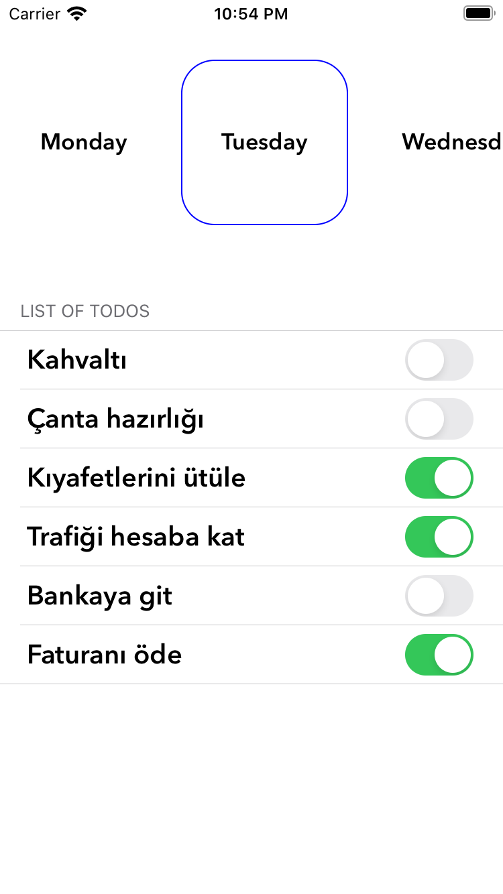

# Drop  

Purpose of the project
======================

Todo apllication implemented with VIP(Clean Swift) pattern.

Screen
======================

  &nbsp; 
    

## Tech-stack :calling:

* [VIP](https://clean-swift.com)

* [Swift 5](https://github.com/apple/swift)

